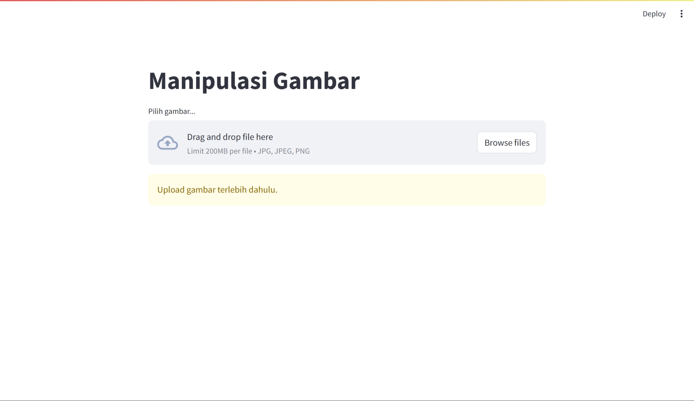
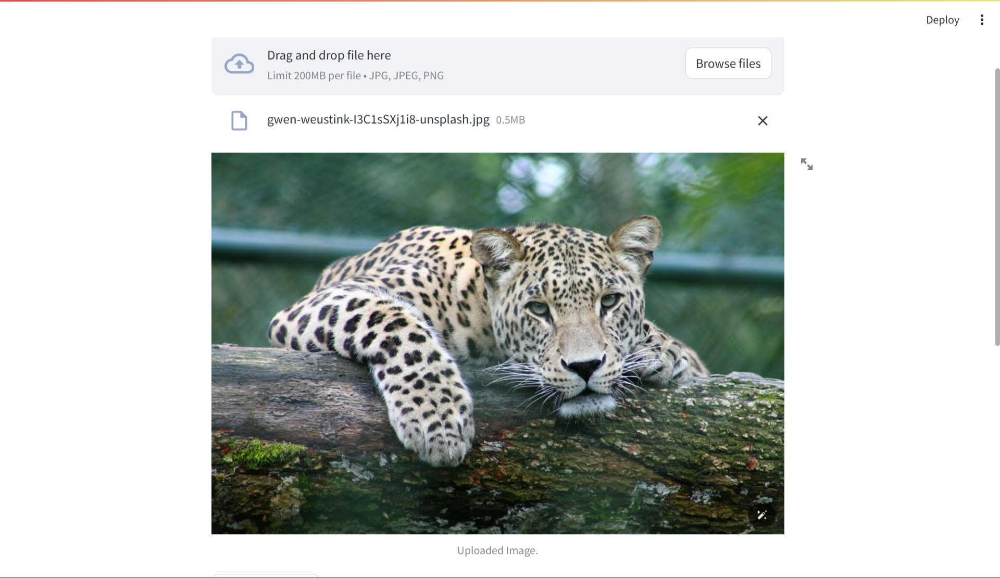
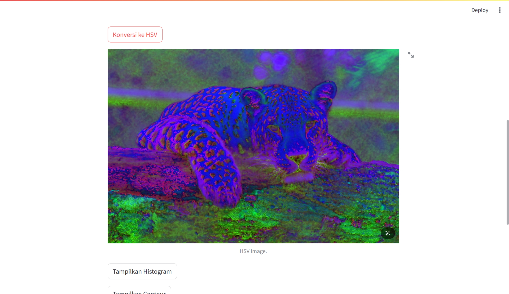
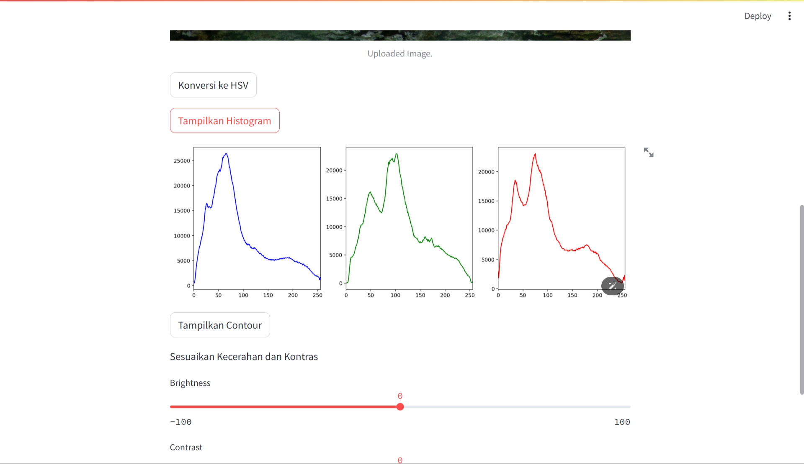
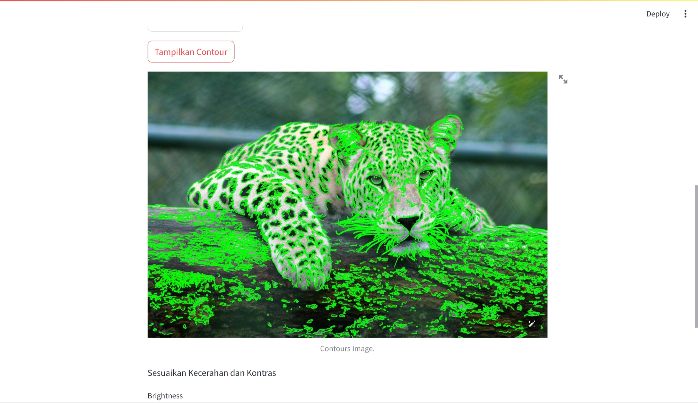
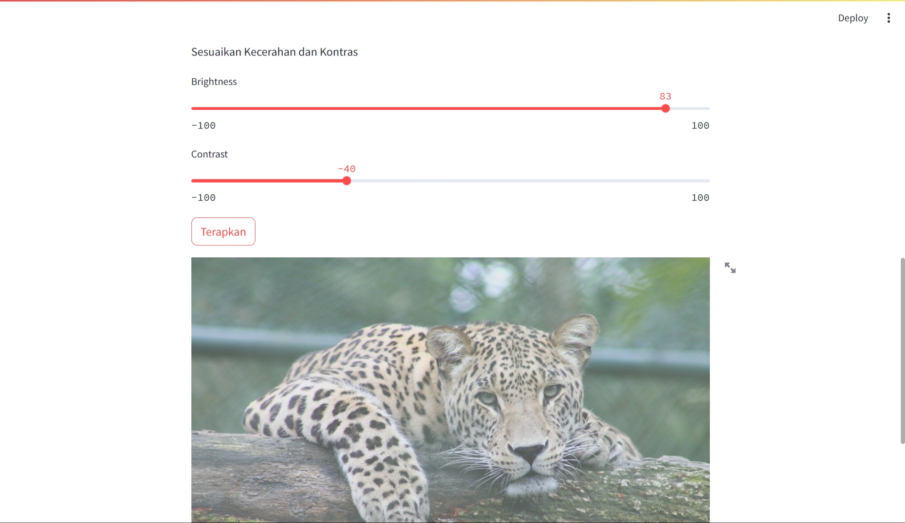

| Nama | NIM | Github |
| --- | --- | --- |
| Alif Nur Fathlii Amarta | 312210326 | [@alifamarta](https://github.com/alifamarta) |
| Galva Al Godzali | 312210356 | [@galvaal](https://github.com/galvaal) |
| Rafif Isdarufa Athallah | 312210299 | [@zangetsuuuu](https://github.com/zangetsuuuu) |
| Wisnu Ikhwansyah Saputra | 312210305 | [@Wizzs1](https://github.com/Wizzs1) |

## Manipulasi Gambar dengan OpenCV dan Streamlit

### Deskripsi
Aplikasi ini memungkinkan pengguna untuk melakukan beberapa manipulasi sederhana pada gambar yang diunggah, seperti konversi ke ruang warna HSV, menampilkan histogram, menampilkan kontur, serta menyesuaikan kecerahan dan kontras.

### Cara Penggunaan
1. **Upload Gambar**
   - Unggah gambar dengan format JPG, JPEG, atau PNG menggunakan tombol "Pilih gambar...".

2. **Konversi ke HSV**
   - Tekan tombol "Konversi ke HSV" untuk mengubah gambar yang diunggah ke dalam ruang warna HSV.

3. **Tampilkan Histogram**
   - Tekan tombol "Tampilkan Histogram" untuk menampilkan histogram dari gambar yang diunggah.

4. **Tampilkan Contour**
   - Tekan tombol "Tampilkan Contour" untuk menampilkan kontur dari gambar yang diunggah.

5. **Sesuaikan Kecerahan dan Kontras**
   - Geser slider untuk menyesuaikan kecerahan dan kontras gambar.
   - Tekan tombol "Terapkan" untuk menerapkan perubahan ke gambar.

### Cara Penggunaan
- Pastikan instalasi Streamlit (`pip install streamlit`) dan OpenCV (`pip install opencv-python`) sudah dilakukan sebelum menjalankan aplikasi.
- Jalankan program dengan menjalankan perintah `streamlit run nama_file.py` di terminal/command prompt.

### Screenshot

#### 1. Tampilan Awal

#### 2. Upload Gambar

#### 3. Konversi ke HSV

#### 4. Tampilkan Histogram

#### 5. Tampilkan Contour

#### 6. Sesuaikan Kecerahan dan Kontras

